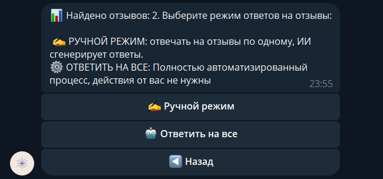
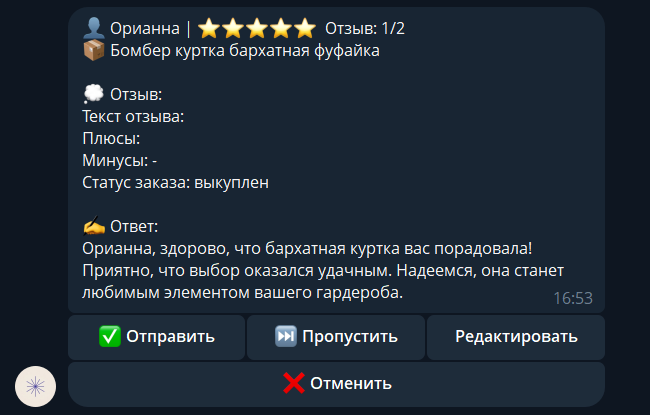

# Wildberries Feedbacks Bot
 
Telegram-бот для автоматизации ответов на отзывы Wildberries c помощью нейросетей. Для селлеров с несколькими кабинетами
 





 
## Возможности
- Бот анализирует с помощью ИИ и отвечает на отзывы исходя из контекста
- Ручной режим: предпросмотр и возможность редактирования ответов перед отправкой
- Автоматический режим: батч-обработка неотвеченных отзывов
- Подключение нескольких кабинетов одновременно
 
## Стек
- **Backend**: Python 3.12.3, aiogram 3.x, aiohttp, asyncio
- **Storage**: SQLite (aiosqlite 0.22.1)
- **LLM**: OpenAI API, Anthropic API, AITUNNEL
- **Infra**: VPS Ubuntu 22.04
 
## Конфигурация
```env
Создай в корне проекта файл `.env` (на основе `.env.example`) и заполни:
BOT_TOKEN=ваш_токен_от_BotFather
AITUNNEL_KEY=sk-ваш_ключ
ADMIN_ID=123456789
```
### Получение WB Feedbacks API токена

1. Зайти в личный кабинет селлера -> Профиль -> Интеграция по API -> Создать токен -> Персональный токен
2. Создать токен с правами «Отзывы и вопросы»
3. Добавить токен в боте
 
## Запуск
```bash
git clone https://github.com/Moraded/Feedbacks_BOT.git
cd Feedbacks_BOT
python -m venv .venv
source .venv/bin/activate
pip install -r requirements.txt
cp .env.example .env # заполни значения переменных в .env
python wb_bot.py
```
 
## Архитектур
```
├──wb_bot.py #точка входа
├──wb_api.py #работа с Wildberries API
├──ai.py #подключение к AITUNNEL, генерация ответа на основе отзыва
├──db.py #работа с SQLite через aiosqlite
├──handlers/ #роутеры aiogram
		├──admin.py 
		├──cabinets.py
		├──reviews.py
		├──start.py
├──keyboards.py #клавиатуры
├──storage.py текущее состояние пользователей
├──system_prompt.py #промпт для ИИ
```
## Статус
Текущий: в разработке. Бот работает стабильно, поддерживает многопользовательность

Ближайшие задачи:
- Миграция пользовательского state из памяти в SQLite
- Type hints во всех модулях
- Тесты на сервисный слой(pytest-asyncio)
- FastAPI-админка с базовой статистикой
 
## Контакты
Telegram: @moraded451


